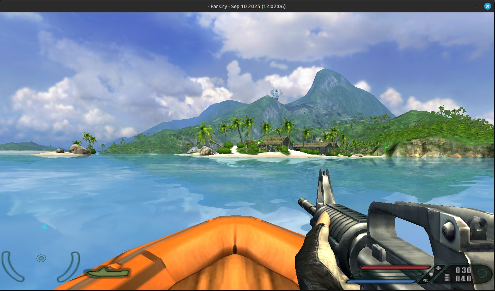

# Near Chuckle - Android Edition



Far Cry (CryEngine 1) ported to Android and Linux via SDL3 with support for Mesa Zink (OpenGL over Vulkan) and custom Turnip GPU drivers.

Based on NearChuckle, with Android architecture inspired by [SCARaw/Android-OpenMW](https://github.com/SCARaw/Android-OpenMW) and [xyzz/openMW-android](https://github.com/xyzz/openMW-android).

---

## Особенности Android порта / Features

### 🚀 Полнофункциональный Лаунчер (Launcher)
- **Выбор папки с игрой:** Удобный выбор каталога с установленной игрой Far Cry (содержащего `FCData`, `Levels` и т.д.) со встроенным проводником и проверкой целостности файлов.
- **Поддержка разрешений:** Автоматическое под экран устройства, FHD (1080p), HD (720p - оптимально для FPS), qHD (540p).
- **Настройка FOV:** Регулировка угла обзора прямо из меню (по умолчанию 90°).
- **Режим разработчика:** Быстрое включение режима `-DEVMODE`.
- **Пользовательские аргументы:** Возможность ввода любых консольных переменных и параметров командной строки CryEngine.

### ⚡ Mesa Zink (OpenGL over Vulkan)
- Полная реализация десктопного OpenGL 2.1 / 3.x через современный графический API **Vulkan**.
- Устраняет ограничения мобильного OpenGL ES и обеспечивает корректную работу всех шейдеров Far Cry.
- Оптимизации Zink для мобильных GPU (`ZINK_DESCRIPTORS=lazy`, переопределения профилей GL/GLSL).

### 🎮 Поддержка Turnip драйверов (ZIP архивы)
- **Установка в 1 клик:** Просто выберите или закиньте `.zip` архив с Turnip драйвером (от Kimchi, Banners-Turnip, WinNative, StevenMXZ, Vauzi или любой совместимый с AdrenoTools).
- Лаунчер автоматически распакует архив, считает `meta.json` (или обнаружит `libvulkan_freedreno.so`), сгенерирует ICD-манифест и зарегистрирует драйвер.
- **Rootless перенаправление:** Использование библиотеки `libadrenotools` для подмены системного драйвера Vulkan на кастомный Turnip без root-прав.
- **Режим GPU Turbo:** Принудительное удержание максимальных частот графического процессора Adreno через ioctl `/dev/kgsl-3d0`.
- Быстрое переключение между установленными версиями Turnip и системным драйвером устройства.

### 🕹️ Качественное сенсорное управление с кнопкой EDIT
- **Аналоговый джойстик:** Точное и плавное управление ходьбой и бегом персонажа (W, A, S, D).
- **Область обзора камеры (Touch Look):** Плавное вращение камеры и прицеливание с регулируемой чувствительностью.
- **Полный набор кнопок действий Far Cry:**
  - Огонь / Стрельба (ЛКМ)
  - Прицеливание / Оптический зум (ПКМ)
  - Прыжок (Space)
  - Присесть (C)
  - Лечь / Ползти (Z)
  - Перезарядка (R)
  - Взаимодействие / Использовать (F) — посадка в джипы, лодки, дельтапланы, открытие дверей, подбор оружия
  - Фонарик (L)
  - Бинокль (B)
  - ПНВ / Тепловизор CryVision (T)
  - Граната (G)
  - Смена оружия (след./пред.)
  - Пауза / Меню (Esc)
  - Быстрое сохранение (F5) / Быстрая загрузка (F9)
  - Консоль (~)
- **Интерактивный режим редактирования (кнопка EDIT):**
  - Кнопка **EDIT** доступна прямо во время игры или в отдельном конфигураторе из лаунчера.
  - **Перемещение:** Нажмите и перетащите любую кнопку или джойстик в любое место экрана.
  - **Изменение размера:** Кнопки **[Размер +]** и **[Размер -]** в панели инструментов.
  - **Изменение прозрачности:** Кнопки **[Прозр. +]** и **[Прозр. -]** для тонкой настройки видимости.
  - **Видимость:** Кнопка **[Скрыть / Показать]** позволяет скрыть ненужные кнопки (в режиме редактирования скрытые кнопки подсвечиваются красным пунктиром, чтобы их можно было вернуть).
  - **Сброс:** Кнопка **[Сброс]** мгновенно возвращает стандартную раскладку.
  - **Сохранение:** Позиции, размеры и видимость сохраняются в `SharedPreferences` и применяются моментально.

---

## Установка и запуск на Android / How to Run

1. Установите скомпилированный APK файл (`app-release.apk` или `app-debug.apk`) на ваше Android-устройство.
2. Скопируйте файлы установленной игры Far Cry с ПК на телефон (например, в папку `/sdcard/FarCry/`):
   - Папка `FCData` (со всеми `.pak` файлами)
   - Папка `Levels` (со всеми уровнями игры)
   - Папка `Profiles`
3. Запустите лаунчер **Far Cry**:
   - Нажмите **"Выбрать папку"** и укажите папку `/sdcard/FarCry`. Лаунчер проверит наличие файлов и отобразит зелёную отметку `✓ Файлы Far Cry обнаружены`.
   - В разделе драйверов выберите драйвер или нажмите **"Установить Turnip драйвер из ZIP"**, если у вас есть архив с Turnip.
   - При желании настройте раскладку кнопок нажав **"Настройка экранных кнопок (EDIT)"**.
4. Нажмите **"ЗАПУСТИТЬ FAR CRY"** и играйте!

---

## Сборка из исходников / Building

### Требования
- Android NDK r25+ (или r26)
- Android SDK (API 34)
- CMake 3.14+
- Java 17+

### Сборка нативных библиотек
Запустите скрипт сборки:
```bash
./buildscripts/build_android.sh --arch arm64 --release --ndk /path/to/android-ndk
```
Скрипт автоматически соберет `libFarCry.so`, библиотеки движка `libCry*.so`, рендерер `libXRenderOGL.so` и поместит их в `android/app/src/main/jniLibs/arm64-v8a/`.

### Сборка APK
Перейдите в каталог `android` и соберите APK с помощью Gradle:
```bash
cd android
./gradlew assembleRelease
```
Готовый APK файл будет находиться в:
`android/app/build/outputs/apk/release/app-release-unsigned.apk` (или debug).

---

## Структура проекта

```
NearChuckle-android-wip-edition/
├── android/                        # Android приложение
│   ├── app/
│   │   ├── src/main/AndroidManifest.xml
│   │   ├── src/main/java/
│   │   │   ├── org/libsdl/app/     # SDL3 Android runtime
│   │   │   └── com/nearchuckle/farcry/
│   │   │       ├── LauncherActivity.java      # Главный лаунчер
│   │   │       ├── GameActivity.java          # Запуск движка + Zink + Turnip
│   │   │       ├── ConfigureControlsActivity.java # Редактор кнопок
│   │   │       ├── controls/                  # Сенсорное управление + Edit mode
│   │   │       └── driver/                    # Менеджер Turnip ZIP архивов
│   │   └── src/main/cpp/
│   │       ├── driver_loader.cpp              # JNI хук для кастомных драйверов
│   │       └── adrenotools/                   # Rootless замена Vulkan драйвера
│   └── build.gradle
├── buildscripts/
│   └── build_android.sh            # Скрипт сборки библиотек NDK
├── Externals/SDL/include/          # Заголовочные файлы SDL3
└── SourceCode/                     # Исходный код движка Far Cry (CryEngine 1)
```

## Лицензия / Credits
- Crytek Far Cry (CryEngine 1)
- [NearChuckle](https://github.com/Player124413/NearChuckle-android-wip-edition)
- [SCARaw/Android-OpenMW](https://github.com/SCARaw/Android-OpenMW) & [xyzz/openMW-android](https://github.com/xyzz/openMW-android) за референсы архитектуры лаунчера и сенсорного управления
- [bylaws/libadrenotools](https://github.com/bylaws/libadrenotools) за библиотеку загрузки кастомных Adreno Turnip драйверов
- Mesa 3D Graphics Library (Zink & Turnip Freedreno)
